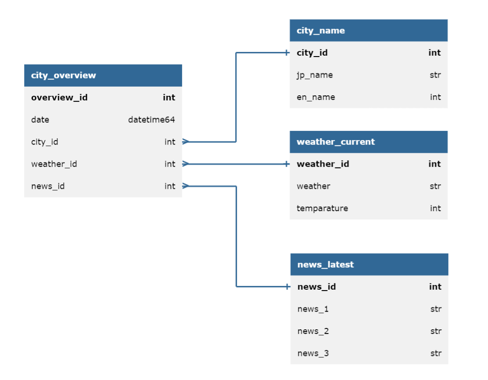

# チーム2メンバ向け：作業TIPS
- repositoryの設定でmainブランチに直接pushできないようにしています．別ブランチを作って，PullRequestを用いてmainブランチに変更を反映してください．
    - mainブランチに直接pushすると下記のようなエラーが出ます．
        ```
         ! [remote rejected] main -> main (push declined due to repository rule violations)
         error: failed to push some refs to 'https://github.com/rhashimoto777/python-03-project-ja.git'
        ```
    - 現時点ではPullRequestにreviewerからの承認が無くてもmergeできるようにしていますが，次の修了プロジェクトでは承認を必須にしようかなと思っています．

# セットアップと実行の手順

- 下記のライブラリを使用します．未導入のものがある場合は導入してください．
    ```
    requests
    datetime
    sqlite3
    pandas
    json
    abc
    os
    ```

- `main.py`を実行してください．
    - `main.py` 内の先頭に，モード選択をするコードが有ります．
    - APIの呼び出し回数を節約するため，GitHub上のデフォルトでは`IS_LOCAL_MODE = True`にしています．これは実際にAPIを用いてデータ取得するのではなく，予め取得済みのjson dumpファイルからデータを読み込むモードです．APIを利用する場合は`False`にしてください．
    - 対象都市を編集する場合は，`main.py`内の冒頭にて`cities`を直接編集ください．

# プロジェクトにおける重要な設計とその設計理由

## 【作成するデータベース】
#### ER図


上図のテキスト版はこちら：https://databasediagram.com/app

```
city_overview
-
overview_id int PK
date datetime64
city_id int FK > city_name.city_id
weather_id int FK > weather_current.weather_id
news_id int FK > news_latest.news_id

city_name
-
city_id int PK
jp_name str
en_name int

weather_current
-
weather_id int PK
weather str
temparature int

news_latest
-
news_id int PK
news_1 str
news_2 str
news_3 str
```

#### データベースの設計詳細
- `city_name`
    - 各都市の和名と英名を同時に扱いたいため，独立したtableにしている．
        - NewsAPIでは日本語の都市名（例：東京）で検索すると簡便で，OpenWeatherAPIは英語の都市名（例：Tokyo）で検索すると簡便であるため．
        - （もしもNewsAPIでも英語の都市名を使ってうまくできるならばこのtable自体が不要である．`city_overview`内の`city_id`の代わりに`city_en_name`を使えばいいだけになる）

- `weather_current`
    - 「現在の天気」を表す．

- `news_latest`
    - 下記全てを満たすニュースを，発行日時が新しい順に3つ選んでいる．
        ```
        (1) ニュースタイトルに都市名（和名）が入っていること
        (2) nhk.or.jpのニュースであること
        ```
    - `news_1` `news_2` `news_3`で表示しているのは，下記のように日付とニュースタイトルを繋げた文字列である．
        ```
        【2024-07-13】「太平洋・島サミット」東京での開催前に外務省で予行演習
        ```
        - 「京都」で検索すると例えば下記のように「東京都」のニュースも引っかかってしまうが，今回の演習はあくまでデータの統合が主目的であり，ニュースの効果的なフィルタリングは出題意図のスコープ外と解釈し，残置する．
            ```
            【2024-07-08】東京都知事選 ポスターの枠不足 元候補者が選挙無効を申し立て
            ```
    
    - NHKのニュースに限定しているのは，デフォルトだと所謂「まとめサイト」の記事が多く，ごみが多いため除去する目的である．
        - また，デフォルトだとチーム名に都市名が入っているようなスポーツ系のニュースも多く引っかかる（例：「札幌」と検索するとサッカーの「コンサドーレ札幌」の記事が多く出てくる）ため，それらも除去すると見た目がある程度すっきりする．それでもその手のニュースは結構残ってしまうが，今回演習の本論とはややずれるため残置する．

- `city_overview`
    - `date`
        - weather_currentが「現在の天気」を表しているため，「現在」がいつなのかを表すフィールドがどこかに必要である．この`date`がその役割を果たす．少なくとも日単位での分解能は欲しいが，フォーマットに特に拘りは無い．

## 【API】

#### News API
- "Everything"のEndspointを用いる．
    - "Top headlines"だと十分数の記事がヒットしない，”Everything”の方が便利なRequest parametersを使える，等の理由により選定した．
- Documentationはこちら：https://newsapi.org/docs/endpoints/everything
- News APIのトップページはこちら．サンプルソースがいくつかある．https://newsapi.org/
- Request parametersにlanguageは存在するが，日本語を選べない．そのため日本語の記事を検索するには，クエリで何らかの日本語（例：東京）を指定するのが手っ取り早い．
- News APIのフリーライセンスは，1日の最大呼び出し回数が100回しかなく少ない．そのため，基本的にはgetした結果をjsonでdumpしておき，開発中はdumpからデータを読み込むことでAPI呼び出し回数の枯渇を防ぐ．
- また，フリーライセンスだと前日以前のニュース取得できない模様．
- ソース中のAPI_KEYは橋本のもの．

#### OpenWeather API
- フリーライセンスで使用できるAPIの一覧はこちら：https://openweathermap.org/price
- 当初はhistory系のAPIを用いて過去日付の天気情報を取得しようと思ったが，過去値の取得系は全て有料ライセンスが必要そうである．
- ソース中のAPI_KEYは橋本のもの．


# このツールまたはサービスの使い方の説明 (ユーザー向けの説明)

- `main.py`を実行してください．
    - `main.py` 内の先頭に，モード選択をするコードが有ります．
    - APIの呼び出し回数を節約するため，GitHub上のデフォルトでは`IS_LOCAL_MODE = True`にしています．これは実際にAPIを用いてデータ取得するのではなく，予め取得済みのjson dumpファイルからデータを読み込むモードです．APIを利用する場合は`False`にしてください．
    - 対象都市を編集する場合は，`main.py`内の冒頭にて`cities`を直接編集ください．